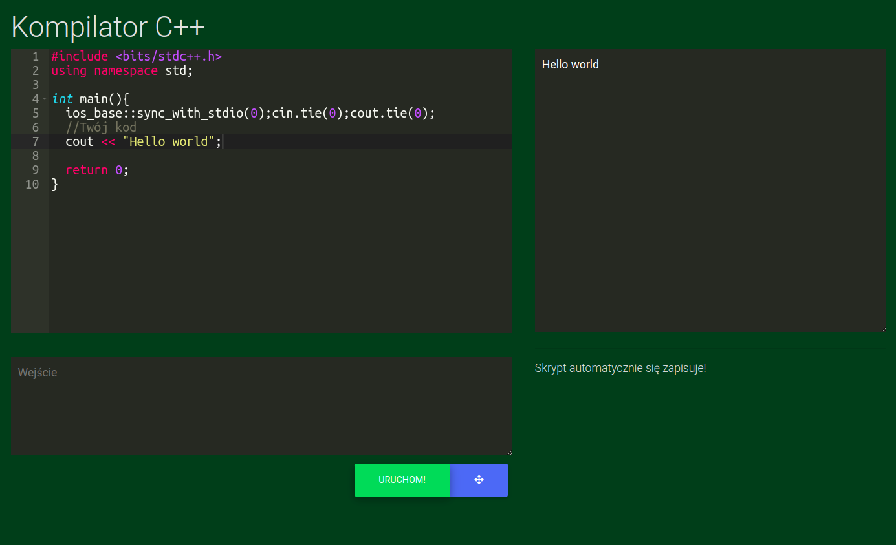

# cpp-compiler

To jest prosty kompilator języka C++<br>
<li>
	Jest on wywoływany na lokalnej maszynie
</li>
<li>
	Jest dosyć przejrzysty interfejs graficzny
</li>
<li>
	Działa w przeglądarce
</li>
<br>


<h1>Instalacja</h1>

```bash
git clone https://github.com/michaljaz/cpp-compiler
cd cpp-compiler
node start.js
```
